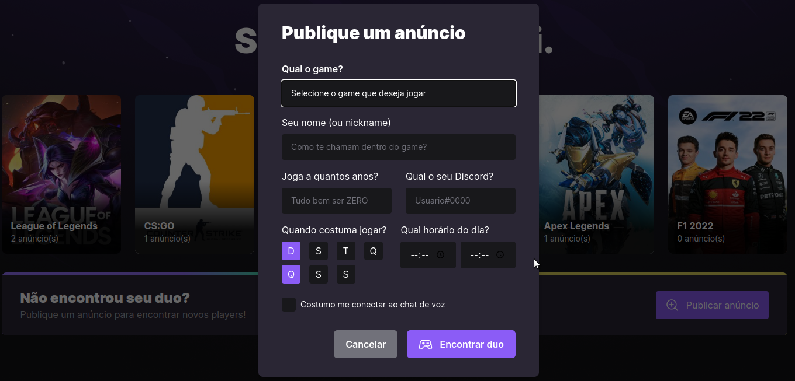

**Web**

**Server**

**Mobile**

## Descrição do projeto
**Objetivo do Projeto**
- ``Clone da API do Twitch que busca parceiros para jogos combinados cadastrando novos usuários, datas, buscando por jogos em comum e mais...``

## 🔨Funcionalidades
  - ``Funcionalidade 1 - Consumir api clone do Twitch``
  - ``Funcionalidade 2 - Cadastrar usuário aliado a jogos``
  - ``Funcionalidade 3 - Buscar jogos e lista todos``
  - ``Funcionalidade 4 - Busca por id do usuário``
  
  
## ✔️ Técnicas e Tecnologias utilizadas
Web [aqui](https://github.com/haileicristina/nlw-esports-ignite/tree/main/web)

Server [aqui](https://github.com/haileicristina/nlw-esports-ignite/tree/main/server)

Mobile [aqui](https://github.com/haileicristina/nlw-esports-ignite/tree/main/mobile)

